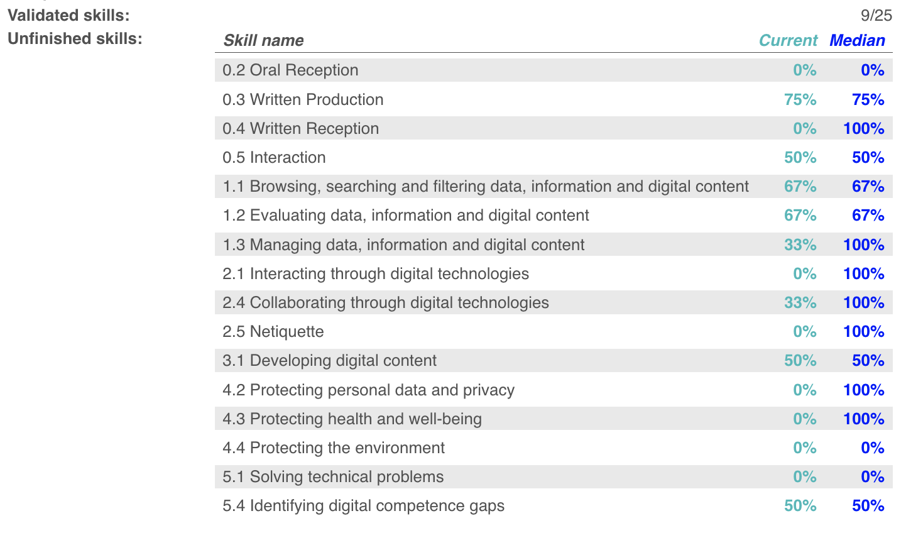
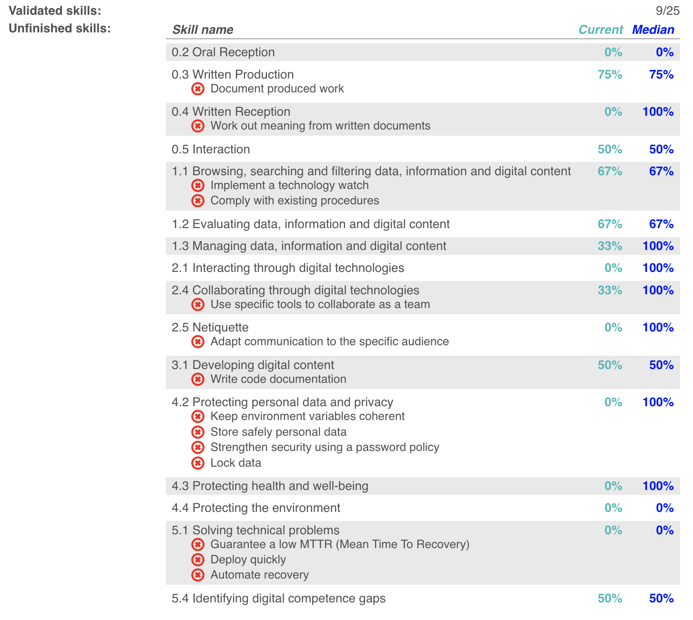
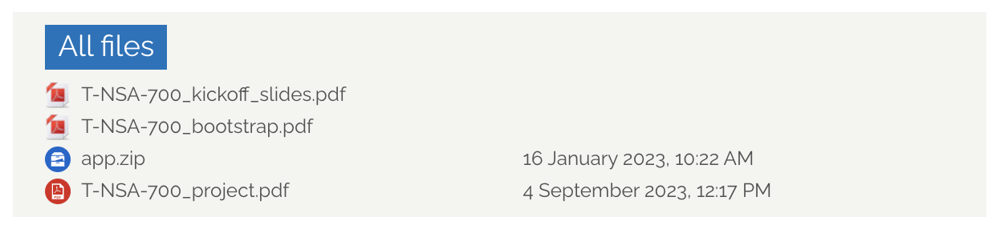

# BetterGandalf

Scripts for a better experience with Epitech MSC intranet

## Installation

1. Install the [Tampermonkey](https://www.tampermonkey.net/) extension for your browser.

2. Select the desired feature's title and then click on 'install'.

## Features

- [Better Competencies interface](https://greasyfork.org/en/scripts/487732-better-competencies-gandalf)
  - Shows the number of validated categories.
  - Allows you to quickly compare yourself with the average for your class.
  - Highlights failed skills in categories still being validated.
  - Changes the colour of the progress bars according to completion.

- [Better Project Files]()
  - Adds a "Files" section to each project, allowing access to all files without having to go to each page

